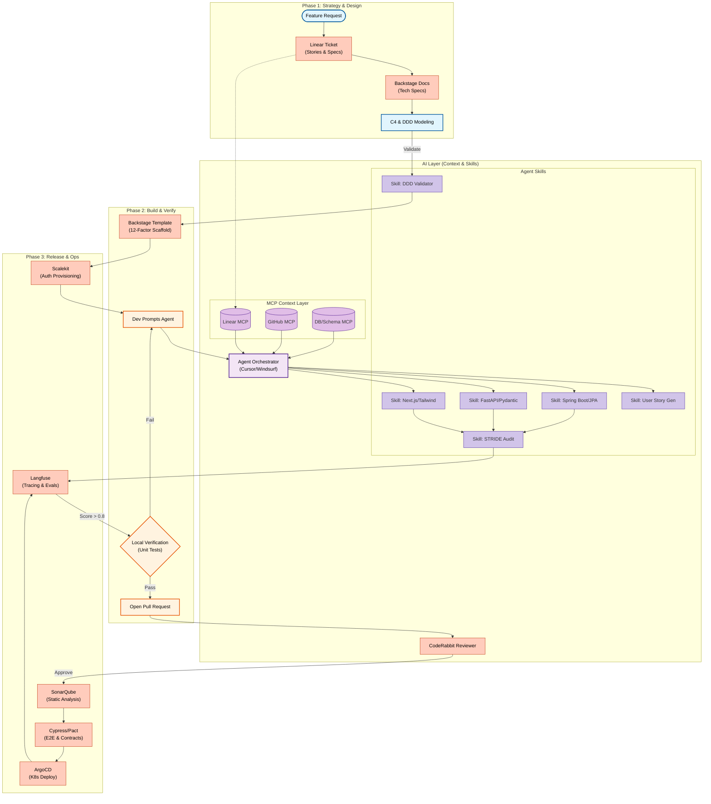

```mermaid
flowchart TB
    %% Define Styles for Swimlanes
    classDef product fill:#e1f5fe,stroke:#01579b,stroke-width:2px,color:#000
    classDef ai fill:#f3e5f5,stroke:#4a148c,stroke-width:2px,color:#000
    classDef dev fill:#fff3e0,stroke:#e65100,stroke-width:2px,color:#000
    classDef ops fill:#e8f5e9,stroke:#1b5e20,stroke-width:2px,color:#000
    
    %% Specific Styles for Elements
    classDef tool fill:#ffccbc,stroke:#bf360c,stroke-width:1px
    classDef mcp fill:#e1bee7,stroke:#4a148c,stroke-width:1px
    classDef skill fill:#d1c4e9,stroke:#512da8,stroke-width:1px

    %% Swimlane: Product & Strategy
    subgraph Product["Phase 1: Strategy & Design"]
        direction TB
        Idea([Feature Request])
        Linear["Linear Ticket<br/>(Stories & Specs)"]
        Backstage_Docs["Backstage Docs<br/>(Tech Specs)"]
        Design["C4 & DDD Modeling"]
    end

    %% Swimlane: AI Agents (The Brain)
    subgraph Agents["AI Layer (Context & Skills)"]
        direction TB
        
        %% MCPs (Context)
        subgraph Context["MCP Context Layer"]
            direction LR
            MCP_Lin[("Linear MCP")]
            MCP_Git[("GitHub MCP")]
            MCP_DB[("DB/Schema MCP")]
        end

        %% Skills (Capabilities)
        subgraph Skills["Agent Skills"]
            direction TB
            Skill_PM["Skill: User Story Gen"]
            Skill_DDD["Skill: DDD Validator"]
            Skill_Java["Skill: Spring Boot/JPA"]
            Skill_Py["Skill: FastAPI/Pydantic"]
            Skill_React["Skill: Next.js/Tailwind"]
            Skill_Sec["Skill: STRIDE Audit"]
        end

        Agent_Orch["Agent Orchestrator<br/>(Cursor/Windsurf)"]
        Rabbit["CodeRabbit Reviewer"]
    end

    %% Swimlane: Engineering (The Hands)
    subgraph Engineering["Phase 2: Build & Verify"]
        direction TB
        Backstage_Templ["Backstage Template<br/>(12-Factor Scaffold)"]
        Dev_Action["Dev Prompts Agent"]
        Local_Test{"Local Verification<br/>(Unit Tests)"}
        PR_Open["Open Pull Request"]
    end

    %% Swimlane: Ops & QA (The Guardrails)
    subgraph Ops["Phase 3: Release & Ops"]
        direction TB
        Scalekit_Auth["Scalekit<br/>(Auth Provisioning)"]
        Langfuse_Ops["Langfuse<br/>(Tracing & Evals)"]
        Sonar["SonarQube<br/>(Static Analysis)"]
        Cypress["Cypress/Pact<br/>(E2E & Contracts)"]
        Argo["ArgoCD<br/>(K8s Deploy)"]
    end

    %% Connections
    %% Phase 1
    Idea --> Linear
    Linear --> Backstage_Docs
    Backstage_Docs --> Design
    Design -->|Validate| Skill_DDD
    Skill_DDD --> Backstage_Templ

    %% Phase 1 -> 2 Scaffolding
    Backstage_Templ --> Scalekit_Auth
    Scalekit_Auth --> Dev_Action

    %% Phase 2 Agent Loop
    Dev_Action --> Agent_Orch
    
    %% Context Injection
    Linear -.-> MCP_Lin
    MCP_Lin --> Agent_Orch
    MCP_Git --> Agent_Orch
    MCP_DB --> Agent_Orch

    %% Skill Usage
    Agent_Orch --> Skill_PM
    Agent_Orch --> Skill_Java
    Agent_Orch --> Skill_Py
    Agent_Orch --> Skill_React
    
    %% Verification
    Skill_Java --> Skill_Sec
    Skill_Py --> Skill_Sec
    Skill_React --> Skill_Sec
    Skill_Sec --> Langfuse_Ops
    Langfuse_Ops -->|Score > 0.8| Local_Test
    
    Local_Test -->|Fail| Dev_Action
    Local_Test -->|Pass| PR_Open

    %% Phase 3 Release
    PR_Open --> Rabbit
    Rabbit -->|Approve| Sonar
    Sonar --> Cypress
    Cypress --> Argo
    Argo --> Langfuse_Ops

    %% Classes
    class Idea,Linear,Backstage_Docs,Design product
    class Agent_Orch,Rabbit ai
    class Backstage_Templ,Dev_Action,Local_Test,PR_Open dev
    class Scalekit_Auth,Langfuse_Ops,Sonar,Cypress,Argo ops
    
    %% Specialized Classes
    class Linear,Backstage_Docs,Backstage_Templ,Scalekit_Auth,Langfuse_Ops,Sonar,Cypress,Argo,Rabbit tool
    class MCP_Lin,MCP_Git,MCP_DB mcp
    class Skill_PM,Skill_DDD,Skill_Java,Skill_Py,Skill_React,Skill_Sec skill
```
